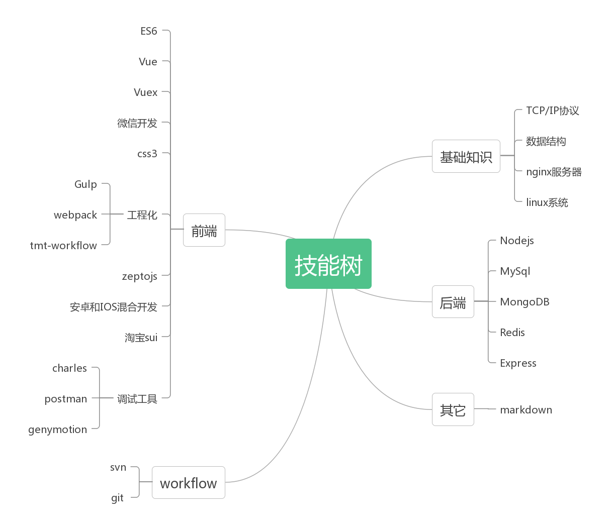

## 个人简介

- 姓名：蔡东亮
- 生日：圣诞节
- 职位：Web 前端开发工程师 && 全栈
- 工作年限： 5年半
- 目前状态：在职
- 手机号：15711537902

我是一只内向的咸鱼，我只想安静地写代码，从中获得些许的乐趣，我喜欢写文章，写自己的[博客](https://troland.github.io),有代码洁癖。经常在*Github*瞎逛,因为英文比较不错的原因，会经常浏览外文网站，即时获取最新的知识，喜欢打篮球，跑步，我的信条就是:

> 快乐生活，快乐coding, yeah!

## 技能树

## 项目开发经验

- 智慧校园课堂(上海易教科技2012.8-2013.7)
  
  **技术栈: jQuery, css3, bootstrap**。这是一款运用于校园内的老师和学生的上课系统。
  
  主要职责：根据产品和设计进行编程，和后端开发人员进行数据交互协调。
  
- 智能家居(上海易教科技2012.8-2013.7)

  **技术栈: jQuery, css3, jQueryUI**。这是一款运用于智能控制家居比如灯光，幕布的web控制系统,多语言方案。用于远程控制家居。
  
  主要职责：根据产品和设计进行编程，和不同的后端还有嵌入式开发人员进行协调。

- PI(上海福蓝汽车2014.08 — 2015.12)

  **技术栈: avalon, jQuery, css3, requirejs**。大众汽车数据查询，报表下载，汽车生命周期，目前使用于上汽等厂商。
  
  主要职责：根据产品和设计进行编程，和后端java进行数据交互，进行性能优化，组件化。
 
- PMS(上海福蓝汽车2013.08 — 2016.03)

  **技术栈: avalon, jQuery, css3, requirejs**。这是一款内部使用的汽车查询系统，供企业用户使用，目前使用于上汽等厂商。
 
  主要职责：根据产品和设计进行编程，和后端java进行数据交互，进行性能优化，组件化。
 
- 嘀叮APP内嵌h5(厦门乐享科技2016.07 - 至今)

  **技术栈: ES6, zeptojs, gulpjs, webpack，SUI**。这是一款流量电话，用流量打电话，协同办公的软件。
 
  主要职责：根据产品和设计进行编程，和后端java进行数据交互，并且需要和ios端和android端进行协调参数的传递。

- [兑换平台](http://exchange.iwop.cn/)(厦门乐享科技2016.07 - 至今)

  **技术栈: ES6, vue, vue-router, webpack, element框架**。虚拟币兑换,前端采用饿了么框架，和后端进行数据对接。
 
  主要职责：根据产品和设计进行编程，和后端java进行数据交互。

- 墨客教育平台(厦门乐享科技2017.05 - 至今)

  **技术栈: ES6, vue, vuex, vue-router, webpack, nodejs**。这是一款在线的教育系统，有多端，PC端和微信端, PC端派课，学生端在微信端购课，在微信端上课。微信公众号可搜索**手学课联网**添加公众号即可。[PC端](org.sxmoc.com)
 
  主要职责: PC端主要采用vue, vuex, vue-router, webpack.微信端，主要在微信公众号里面，比较复杂有nodejs作为中间层，采用的vue多页应用。和java端数据交互，根据原型和设计图进行编程。微信端的所有的SDK包括支付，分享等都由nodejs端完成。
 
 在大前端的浪潮下，各种终端层出不穷，微信小程序等，多端的适配，还有其它一些前端可以做的事情，react,vue等框架，前端愈来愈精彩。